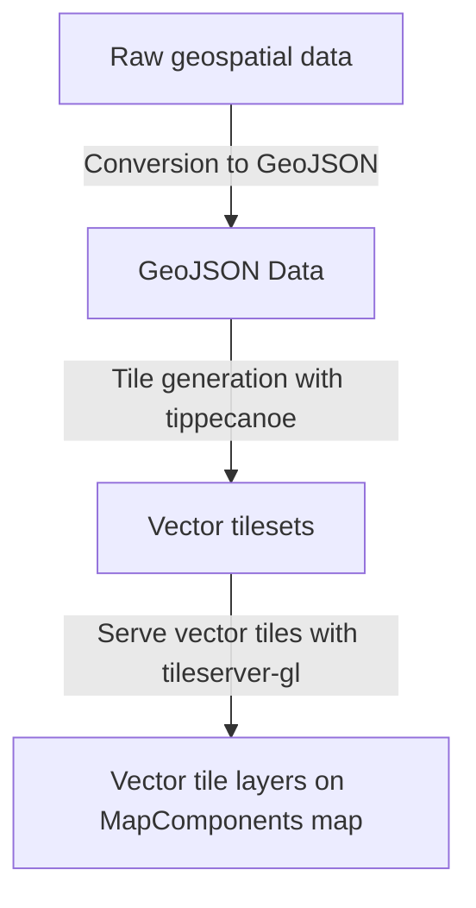

# Vectortiles

## Step-by-Step Guide: Adding Vectortiles Using MlVectorTileLayer

# Vector Tiles

This chapter will guide you on how to integrate vector tiles as layers on the map of a MapComponents project using the `MlVectorTileLayer` component.

## Important properties

- `sourceOptions?: VectorSourceSpecification;`

  This optional prop allows you to specify the source options for the vector tile layer. The `VectorSourceSpecification` type is an interface from the `maplibre-gl` library that describes the properties of a vector source. It includes properties like `url`, `tiles`, `bounds`, `scheme`, `attribution`, and `minzoom` and `maxzoom`. This prop gives you fine-grained control over the source of your vector tile layer.

  ## Using `sourceOptions` Prop

  To specify detailed source options for the vector tile layer, use the `sourceOptions` prop:

  ```javascript
  <MlVectorTileLayer
    sourceOptions={{
      type: "vector",
      url: "http://localhost:8080/data/geojson_layers/{z}/{x}/{y}.pbf",
      minzoom: 0,
      maxzoom: 14,
    }}
    layers={
      [
        /* layer specifications */
      ]
    }
  />
  ```

- `url?: string;`

  This optional prop allows you to specify the URL of the vector tiles data. This is a convenient way to set the source of the vector tile layer if you don't need to specify other source options.

  > **Note:** If both `url` and `sourceOptions` are provided, the component will ignore the `url` prop. This is important to keep in mind for avoiding configuration conflicts.

  ## Using url Prop

  For a simpler configuration, you can directly use the url prop:

  ```javascript
  <MlVectorTileLayer
    url="http://localhost:8080/data/geojson_layers/{z}/{x}/{y}.pbf"
    layers={
      [
        /* layer specifications */
      ]
    }
  />
  ```

- `layers: LayerSpecification[];`

  This prop allows you to specify one or more layer specifications for the vector tile layer. The `LayerSpecification` type is an interface from the `maplibre-gl` library that describes the properties of a layer. It includes properties like `id`, `type`, `metadata`, `source`, `source-layer`, `minzoom`, `maxzoom`, `filter`, `layout`, and `paint`. This prop allows you to define how the vector tiles data will appear on the map.
  Below is an example showing how to set these specifications:

  ```typescript
  <MlVectorTileLayer
    url="http://localhost:8080/data/geojson_layers/{z}/{x}/{y}.pbf"
    layers={[
      {
        id: "my-layer",
        type: "fill",
        source: "my-source",
        "source-layer": "my-source-layer",
        paint: {
          "fill-color": "#007cbf",
        },
      },
      // more layer specifications...
    ]}
  />
  ```

## Using the MlVectorTileLayer to display large amounts of geojson data

In guide we will demonstrate how to generate vector tiles from GeoJSON feature collections, serve them with tileserver-gl and display the data on a MapComponents map.



## Import the MlVectorTileLayer Component

First, you need to import the `MlVectorTileLayer` component from the `@mapcomponents/react-maplibre` library:

```javascript
import { MlVectorTileLayer } from "@mapcomponents/react-maplibre";
```

## Prepare Your Vector Tiles Data

Vector tiles data are usually hosted on a tile server. You will need the URL to the vector tiles data. The URL typically follows this pattern: `http://localhost:8080/data/geojson_layers/{z}/{x}/{y}.pbf` Here, `{z}`, `{x}`, and `{y}` are placeholders that represent the zoom level, and the tile's x and y coordinates, respectively.

### Example: create a vector-tileset from a folder of geojson files

```bash
FILES=()

# Read all GeoJSON filenames from the directory "geojson/" into an array
for file in geojson/*.json; do
    FILES+=("$file")
done

# Run tippecanoe to create the combined vector tileset
# Each FeatureCollection will get a source layer in the vector-tile-set named after it's "name" property
tippecanoe -o "geojson_layers.mbtiles" \
    --maximum-zoom=16 \
    --minimum-zoom=0 \
    "${FILES[@]}"

```

Now you can use a tileserver to host the vector-tiles.

`docker run --rm -it -v $(pwd):/data -p 8080:8080 maptiler/tileserver-gl`

## Add the MlVectorTileLayer to Your Map

Once you have the URL to your vector tiles data, you can add it to your map using the `MlVectorTileLayer` component. Use the `options` prop to specify layer options such as `id`, `type`, and `paint` properties.

```javascript
<MlVectorTileLayer
  url="http://localhost:8080/data/geojson_layers/{z}/{x}/{y}.pbf"
  layers={[
    {
      id: "my-layer",
      type: "fill",
      source: "my-source",
      "source-layer": "my-source-layer", // this works if the vector-tile-set contains a source-layer called "my-source-layer"
      paint: {
        "fill-color": "#007cbf",
      },
    },
  ]}
/>
```

## Important Links for Vector Tiles

- **Tippecanoe**
  A tool for building vector tilesets from large collections of GeoJSON features.
  [Tippecanoe by Mapbox](https://github.com/mapbox/tippecanoe)

- **Awesome Vector Tiles Repository**
  A curated list of awesome vector tile resources.
  [Awesome Vector Tiles](https://github.com/mapbox/awesome-vector-tiles)

- **TileServer-GL**
  A server for serving vector and raster tiles from MBTiles files.
  [TileServer-GL](https://github.com/maptiler/tileserver-gl)

- **pg_tileserv**
  A lightweight tileserver to serve vector tiles directly from PostGIS.
  [pg_tileserv](https://github.com/CrunchyData/pg_tileserv)

- **Documentation**
  - Mapbox Vector Tile Documentation: [Mapbox Docs](https://docs.mapbox.com/style-spec/reference/layers/)
  - MapLibre GL JS Documentation: [MapLibre Docs](https://maplibre.org/maplibre-gl-js-docs/style-spec/layers/)
