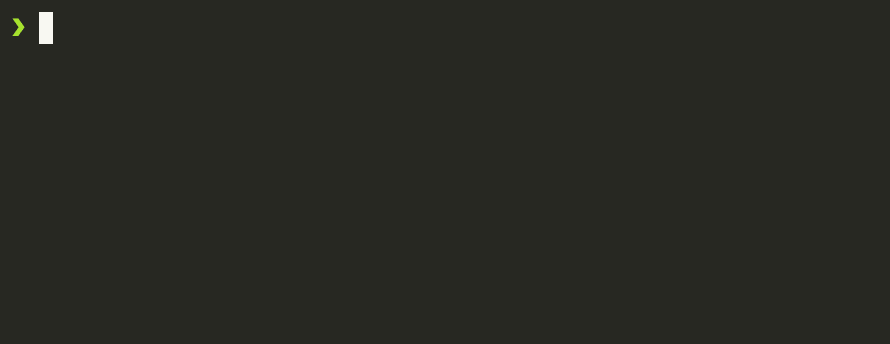

# Start a new MapComponents app

<!--@abc: config({ "asciinema": { "speed": 1, "cols": 60, "rows": 10 } }) -->


First bootstrap the react app using the MapComponent template. The template is based on vite which is (at the time of writing this document) considered a best practice to initialize a new react project.

<!--@abc: exec() -->
```bash
npx degit mapcomponents/template my-mc-app
```


Change into the app directory and install the dependencies using yarn

<!--@abc: exec() -->
```bash
cd my-mc-app
yarn
```


<!--@abc: config({ "basePath": "my-mc-app/" }) -->
Start the development server that will by default serve the app on localhost:5173 and watch the filesystem for changes to compile and hot-reload the browser tab that is running the app.

<!--@abc: exec() -->
```bash
yarn dev
```



Open http://localhost:5173 in your browser to run the current code state with hot-reloading.


<!--@abc: spawn({"command":"yarn dev"}) -->
<!--@abc: browse({"url":"http://localhost:5173"}) -->
